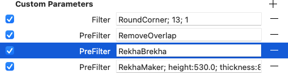

# RekhaBrekha

This is a plug-in for the [Glyphs font editor](https://glyphsapp.com/). It serves as conjunct decomposer for rekha scripts (Bengali, Devanagari, Gurmukhi), useful in conjunction with [RekhaMaker](https://github.com/mekkablue/Rekha).

If you use regular letters as components in conjuncts, and the conjuncts have a rekha line or two too many, this plug-in is for you. It will decompose any component that references an active (exporting) Bengali, Devanagari or Gurmukhi letter.


### Usage instructions for RekhaBrekha

This is only useful as a PreFilter in your static font exports. To add the PreFilter, copy the following lines:

```
{
customParameters = (
{
name = PreFilter;
value = RekhaBrekha;
}
);
}
```

... and paste it into the *Custom Parameters* section of your static font in *File > Font Info > Exports:*




### Installation

Install the plugins via *Window > Plugin Manager > Plugins.* Restart the app.

### Requirements

The plugin needs Glyphs 3 or higher, running on OS X 10.11 or later. I can only test it in current OS versions, and I assume it will not work in older versions.

### License

Copyright 2020 Rainer Erich Scheichelbauer (@mekkablue). Many thanks to Tanya George (@TanyaTypes). Based on sample code by Jan Gerner (@yanone) and Georg Seifert (@schriftgestalt).

Licensed under the Apache License, Version 2.0 (the "License");
you may not use this file except in compliance with the License.
You may obtain a copy of the License at

http://www.apache.org/licenses/LICENSE-2.0

See the License file included in this repository for further details.
